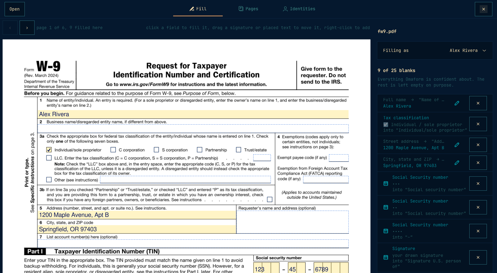
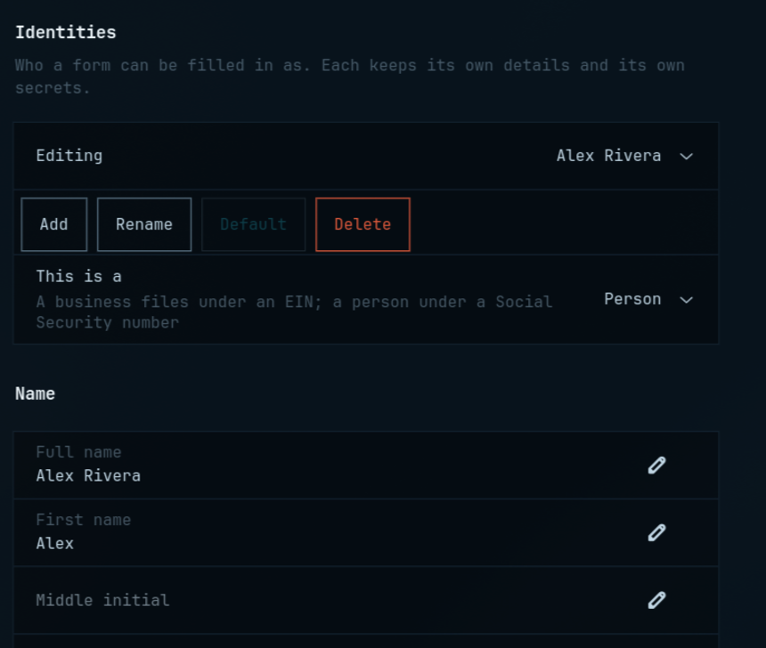
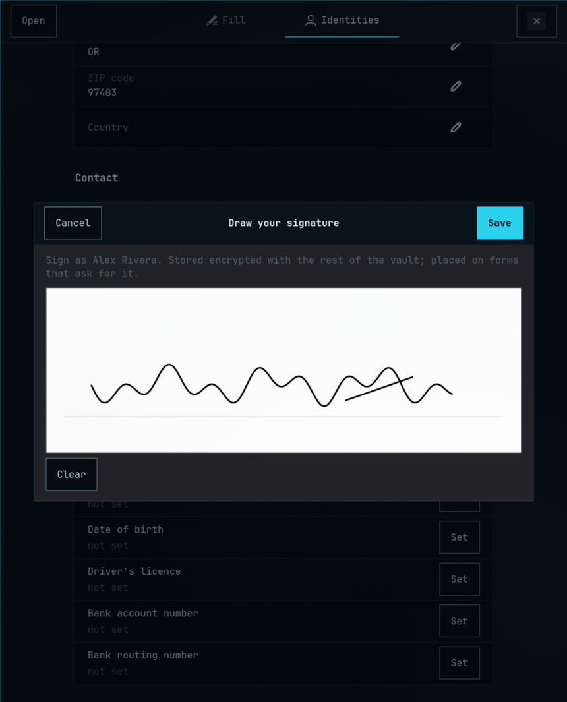
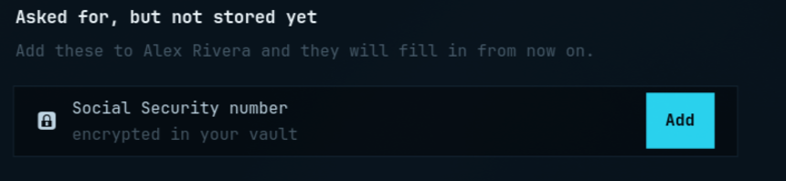

# Omaform

**Fill it out once and for all.** A form filler for Omarchy that remembers who you are.

Open a document, and every blank that asks for your name, address, phone, email, tax
identification number or signature is already filled. PDF forms, flat PDFs with no
fields, scans and Word documents. Your private data stays in an encrypted vault, and
nothing leaves your machine unless you ask your Omarchy agent for help with a
confusing form.

**[Watch the 73-second tour](https://github.com/fluxcapctr/omaform/releases/download/v1.0.0/omaform.mp4)**



## Install

As an Omarchy plugin, which puts Omaform in the bar:

```console
omarchy plugin add https://github.com/fluxcapctr/omaform --enable
```

Then click the form icon in the bar and choose **Install Omaform**. Or from a clone:

```console
git clone https://github.com/fluxcapctr/omaform && cd omaform
./install.sh
```

Either way `install.sh` does the same thing, as you, with no root access: a Python
environment in `~/.local/share/omaform-venv`, the `omaform` and `omaform-ui` commands in
`~/.local/bin`, the launcher entry and icon, and a Downloads watcher unit left off
until you turn it on. If a system library is missing it stops and prints the pacman
line that adds it. Run it again after `omarchy plugin update` (the bar icon offers
this when the plugin is newer than what is installed).

**What it needs.** From Arch: `gtk4`, `libadwaita`, `python-gobject`, `python-cairo`,
`poppler` and `poppler-glib`. From pip, into its own environment: `pikepdf`,
`cryptography`, `argon2-cffi` and `Pillow`. Optional: `tesseract` and
`tesseract-data-eng` for scans, `libreoffice-fresh` for Word documents, `libsecret` to
remember the vault passphrase, an Omarchy agent or Ollama for confusing forms.
`omaform doctor` shows what is present and what each missing piece would add.

## First run

The first time the window opens it walks you through five short pages, and the gear
button in the header brings them back any time (`omaform-ui --setup` does too):

1. **Welcome.**
2. **You:** name, address, email and phone. The rest, and a business or family member,
   on the Identities tab later.
3. **Your private data:** choose the vault passphrase that encrypts your SSN, EIN,
   date of birth and signature, and optionally keep it in the keyring.
4. **Your Omarchy agent:** Omaform finds the agent you picked with `omarchy default
   agent` (Claude Code, Codex, OpenCode, Gemini, Copilot, Cursor, Crush, Pi or Hermes)
   and any local Ollama model, lets you choose which one to ask, and tests the
   connection with a single word. Nothing about you is sent. No agent yet? It says
   how to pick one; everything else works without it.
5. **Forms in:** a notification with a Fill button when a form lands in Downloads, and
   whether PDFs open in Omaform.

## Remove

```console
~/.config/omarchy/plugins/io.github.fluxcapctr.omaform/uninstall.sh   # or ./uninstall.sh in a clone
omarchy plugin remove io.github.fluxcapctr.omaform                    # if you added the plugin
```

`uninstall.sh` removes the launcher entry, icons, commands, watcher unit and Python
environment, and keeps your identities, vault and remembered forms in
`~/.local/share/omaform`. `./uninstall.sh --purge` deletes those too, after asking.

## What it looks like


Open a form and the page appears with the fill already drawn on it: every value in
its box, every tick in its checkbox, the signature on its line, at exactly the size it
will be saved at. Every field the form has is outlined, filled or not, so nothing is
invisible. Beside the page, a row per value says what Omaform recognised and where it
is going in the form's own words; hover a row and the page shows which box it is.
Adjust a value there, or clear it with its X, and the page follows.

The pages scroll as one document, and the bar above says which page is under the
pointer; the arrows jump a page at a time.

It is a form filler for any PDF, not only the ones it recognises. Click any field on
the page to fill it: a checkbox toggles, a text box asks for its text. Right-click
anywhere to sign, date, type or tick at that point, for the lines a form never made a
field for. Everything you set by hand survives switching identities. Then press the
button.

## What works today

```console
$ omaform profile set full_name="Alex Rivera" address1="1200 Maple Avenue" address2="Apt B" \
      city=Springfield state=OR zip=97403 email=alex@example.com

$ omaform fill ~/Downloads/fw9.pdf --once ssn=123-45-6789 --prefer ssn
  ✓ 1 Name of entity/individual. An entry is required. (   full_name      = Alex Rivera
  ✓ 2 Business name/disregarded entity name, if differen   business_name  = Rivera Design Co
  ✓ See 5Address (number, street, and apt. or suite no.)   address1       = 1200 Maple Avenue, Apt B
  ✓ 6 City, state, and ZIP code                            city_state_zip = Springfield, OR 97403
  ✓ Social security number                                 ssn            = ***
  ✓ –                                                      ssn            = **
  ✓ –                                                      ssn            = ****

wrote 7 values to fw9-filled.pdf
```

The IRS W-9 and W-4 and the USCIS I-9 fill from the command line. `omaform inspect FILE`
shows every blank, the label it found, and what it would write, without touching the
file. `-n` is a dry run.

A PDF with no form fields at all is read from its drawing: every printed rule or run of
underscores with a label beside it becomes a blank, written straight into the page
content on save. A scan, which has neither fields nor drawing, goes through tesseract
for its words and through its own pixels for its rules, and then reads the same way.
Because those labels were read rather than given, a scan's blanks are always offered
for a look first and never written unprompted.

A Word document is read as a text stream, which is the easy version of the same
problem: content controls, the old Developer-tab form fields, an empty table cell
beside a labelled one, and `Name: ________` in body text all become blanks, with the
words before them as their label. Filling writes a `.docx`, with a signature as an
inline picture on its line; Lock when saving writes a PDF instead. There is no page to
draw, so the page view shows a PDF that LibreOffice makes in the background, and the
field list is the interface. Read and written with the standard library: minidom keeps
every namespace declaration Word wrote, and Word refuses a file that has lost one.

The page view takes the keyboard too. Tab lands on the first field, letters go
straight into the box with a caret showing where, Tab commits and moves to the next
field in reading order, Shift+Tab goes back, Space ticks a box, Escape leaves. The
click dialog is still there for a box that needs a Clear button.

Anything that must not leave with the file can be blacked out: drag over it in the
page view, or `omaform redact out.pdf in.pdf --text 123-45-6789`. A black box drawn on
top of text is not a redaction, so this is not that. The page is re-rendered with the
region already black and rebuilt as a picture, with its fields, text layer and
annotations gone. Pages with no black-out are left as they were. The cost is that a
blacked-out page can no longer be searched or filled, which is the correct cost.

## What it refuses to do

Guessing wrong on a document you sign is worse than leaving a box empty, so:

- **Someone else's section stays empty.** An I-9's employer and preparer sections, a
  W-9's requester block, a form's witness or notary lines. Detected from the label and
  from the section heading it sits under.
- **Either/or is never both.** A W-9 asks for an SSN *or* an EIN, with a literal "or"
  printed between the rows. If your profile can satisfy both, Omaform fills neither and
  tells you to pick with `--prefer`.
- **Dates that are not today stay empty.** An expiry date, a hire date, a rehire date.
- **Anything it is not sure about stays empty**, and says so, rather than filling in
  something plausible.

## It remembers a form once you have saved it

Pressing Fill and save is the check: the page was looked at and accepted. So that is
when the form is remembered, with nothing else to press. The next time the same form
opens it fills the way it was saved and the rows say "as last time", with a Forget
button if that is wrong. What is kept is structure, never content: which key went in
which box, which boxes were ticked, what was cleared, and where a signature was placed
by hand. Values are resolved from the profile afresh, and free text typed for one
occasion is not kept. A revised edition of a form is a new form and is read fresh.
From the command line: `omaform fill --fresh` ignores it, `omaform forget form.pdf`
drops it.

## Only what it is sure of

The matcher writes a value only when the form's words match one of its phrases
exactly. A near-miss, a typo or an unfamiliar wording, is listed under "Probably, but
not sure" with an Accept button, never written on its own. Every fill checked by hand
on the real forms was an exact match; the near-misses had never once been right.

Beyond the words themselves, it asks whose box it is. A section headed "Supplement A,
Preparer and/or Translator Certification", a block titled "Employers Only", a caption
row that opens "Employers name and address", a label that says "Signature of Employer":
all of it stays empty, because a wrong value on a signed form is worse than an empty
box. The I-9 fills its Section 1 and nothing on its other three pages; the W-4 fills
the employee's block and leaves the employer's alone.

## Asking a model to read a form

The matcher is a word list, not a reader. It fills what it recognises and says nothing
about "complete Part III only if you answered Yes to question 4". For forms like that,
press **Ask a model to read it**. It is never automatic; most forms do not need it.

It is an audit as much as a read. The model is shown the form's questions, the *names*
of your stored details, and on every blank the matcher filled, which key it chose. It
never sees a value: it learns that a key called `ssn` exists, not what it holds. It is
told to keep, correct or clear each of the matcher's choices, and to be strict, since a
wrong value on a signed form is worse than an empty box. Its answer is resolved locally
from your own profile, so it cannot put anything on the page you did not store. What it
changed is listed under "The model changed", with its reasons, and anything it could
not settle under "The model asks". It never touches a checkbox:
boxes are ticked from stored facts it is not shown, and on its first outing it ticked
"Individual" for an S corporation on exactly that basis.

Two places to ask, chosen in the dialog:

- **On this machine**, through Ollama, preferring Omarchy's bundled `omarchy` model.
  Nothing leaves the computer. The first answer can take a minute while the model
  loads; the W-9 took 48 seconds.
- **Omarchy's default agent**, whichever one `omarchy default agent` names, run in its
  headless mode. Omarchy's own launcher opens the agent in a terminal, which a program
  cannot read back from, so its print mode is used instead. If that agent is a cloud
  service the dialog says so before you press Ask.

Its reading is kept per form, so it runs once for each new form you meet and is reused
silently after that; "Forget its reading" in the same dialog clears it. From the
command line it is `omaform fill form.pdf --ask-model ollama` or `--ask-model agent`.

## Your information

Two tiers, because an address and a Social Security number do not deserve the same
treatment.

**The plain tier** is `~/.local/share/omaform/profile.json`, mode 0600: name, address,
phone, email, business name. Annoying to retype, not damaging to lose. Plain JSON on
purpose, so it is greppable, diffable and editable in any editor when this program has
a bug.

**The vault** is `~/.local/share/omaform/vault.enc`, and it holds the rest: SSN, EIN,
bank account and routing numbers, date of birth, driving licence. The plain store
refuses these outright, so there is no way to end up with an SSN in cleartext by
accident.

```console
$ omaform vault init            # asks twice, calibrates the key derivation
$ omaform vault set ssn         # prompts for the value, so it misses shell history
$ omaform vault list            # key names only, and no passphrase needed for that
$ omaform vault keyring on      # optional: open it without a prompt, see the caveat
```

Then `omaform fill` asks for the passphrase only when a form actually wants a sensitive
value, and only once:

```console
$ omaform fill fw9.pdf --prefer ssn
this form needs ssn from your vault
Vault passphrase:
```

### How the vault is built

A random 32-byte data key encrypts the contents. That key is itself encrypted under a
key derived from your passphrase with Argon2id. Two layers rather than one so that
changing your passphrase re-wraps 32 bytes instead of re-encrypting everything.

Both layers are ChaCha20-Poly1305, authenticated over the format version, the key
derivation parameters, and the list of key *names*. That last one matters: the names
are stored in the clear so `omaform inspect` can tell you a form wants your SSN without
asking for a passphrase, and binding them into the AEAD means nobody can quietly delete
`ssn` from that list to make Omaform believe you have not got one. Editing the parameters
to something weak, swapping in another vault's wrapped key, or flipping a single
ciphertext bit are all detected and refused.

Argon2id cost is **calibrated on your machine** rather than hardcoded, targeting about
half a second per unlock, with 256 MiB of memory per attempt. A fixed default that felt
slow on the author's laptop is not a defence anywhere else: this machine computes 64 MiB
at t=3 in 17 milliseconds, which is 60 guesses a second.

### Why encrypt at all, on a machine with full-disk encryption

A powered-off LUKS volume already yields nothing, so FDE does most of the work. The
vault covers the four things it cannot: anything running in your session can read
`~/.local/share` while FDE sits unlocked; backups leave the machine and a plaintext SSN
in home is an SSN on an external drive; accidents like screen sharing and stray
`git add`s expose whatever is in the clear; and this ships publicly to plenty of people
with no FDE at all.

### The rest of the handling rules

Sensitive values are never printed in full, never put on the clipboard, and never
written to a log. **There is no network code in this program at all**: no telemetry, no
update check, no cloud OCR. It is a short `grep` to confirm that.

`omaform vault keyring on` stores the passphrase in the login keyring so nothing is ever
prompted. It is offered because the alternative is people choosing a weak passphrase,
but it is weaker in exactly the way a browser's saved passwords are weaker: while your
session is unlocked, anything running as you can ask the keyring for it. The command
says so before it does it.

Filled output PDFs do of course contain the values in plain text. Omaform says so when it
writes one.

## Identities

Forms get filled on behalf of different parties: yourself, your company, your spouse.
Each is an identity with its own details and its own secrets, and the dropdown at the
top of the fill view chooses between them. The Identities tab is where they are edited,
so keeping your details current never means going back to a terminal.

Every identity is either a **person** or a **business**, and that settles the one
either/or nearly every tax form asks: a business files under an Employer Identification
number, a person under a Social Security number. Both answer a box labelled only "TIN",
which is why the answer belongs to whoever is filing rather than being asked again on
every W-9.



Sensitive values sit at the bottom of that tab behind the vault. They show as stored or
not set and are never displayed, only used.

### Signature

Each identity can carry a signature, drawn once with the mouse, trackpad, pen or finger
on a white pad, and stored encrypted in the vault as a PNG. Black ink on a transparent
ground, trimmed to the ink and rendered at three times screen resolution, so it will sit
cleanly on a page.



Forms that ask for a signature get it. The I-9's "Enter Signature of Employee" line is
a plain text box, so the signature is not typed into it; it is drawn onto the page over
the box as an image, at a size a hand would sign at, and the box itself is retired so
the form's own field background cannot sit on top of the ink. Only your own line is
signed: the employer's and preparer's signature lines on the same form stay empty.

The W-9's "Sign Here" block has no field at all, just printed words and a rule. Omaform
finds that line from the page text, signs on it, and writes today's date beside the
printed "Date". If a form asks for a signature and you have not drawn one, the fill view
offers the pad right there.

### What a W-9 needs beyond a name

An identity carries the answers forms ask as checkboxes, set once on the Identities
tab: **tax classification** for a W-9's line 3a (individual, C corporation, S
corporation, partnership, trust or estate, or an LLC taxed as one of those, with the
letter going in the small box beside the LLC tick); **filing status** for a W-4's Step
1(c); and **citizenship status** for an I-9's Section 1, which lives in the vault
because a legal status is not an address. A box is ticked when it stands for the
stored answer, which is how the W-4's one box labelled "Single or Married filing
separately" serves two answers. Checkbox labels sit to the *right* of the box, unlike
every other field on a form, and are read from there. A form that has one of these
groups when the identity has not answered says so, with a button to answer.

The **apartment** goes where the form can take it. A form with its own apartment box
gets it there; the W-9 has none, so it is folded into the street line as
"2450 Chelsea Pl, Apt B" rather than dropped. A unit that already says Suite, Unit or #
is left as written.

**Dates** fill themselves: a box asking for the date, or the printed "Date" beside a
signature line, gets today, while expiry, birth, hire and rehire dates are left alone.

You do not have to go looking, though. When a form asks for something the chosen
identity has not got, the fill view says so and offers to add it there and then:



That list is only what is genuinely missing. A person filing a W-9 is not told they are
missing an EIN, because they are not.

From the command line the same thing is `--profile`:

```console
$ omaform profile new --kind business "Eric Stevens Design"
$ omaform profile set --profile eric-stevens-design business_name="Eric Stevens Design"
$ omaform vault set --profile eric-stevens-design ein
$ omaform fill w9.pdf --profile eric-stevens-design
```

`omaform profile kind --profile <name> --kind business` changes an existing one.

## In the launcher

After `install.sh`, Omaform appears in the application launcher, and in the Open With menu for any
PDF or image of a form, which is how a form saved from the browser gets here. Evince
stays the default PDF handler on purpose; `xdg-mime default omaform.desktop
application/pdf` changes that if you want it.

### Forms in

```console
systemctl --user enable --now omaform-watch
```

A user service watches `~/Downloads`. When a new PDF settles there and turns out to
have blanks in it, one notification appears with a Fill button; a PDF with nothing to
fill gets no notice at all. Nothing opens on its own. `omaform watch FOLDER` runs the
same thing in a terminal.

### Forms out

After Fill and save, the page shows the saved copy with Open, Copy and Email buttons,
and the row itself can be dragged into an email or a folder. Omarchy's mail is a web
mailbox, and a web mailbox cannot take an attachment from the command line, so Email
opens the message and puts the file on the clipboard for a paste; dragging the row
into the compose window works too.

Omarchy tiles it full height, which leaves the window emptier than it needs to be. If
you would rather it floated, in `~/.config/hypr/hyprland.conf`:

```
windowrule = float, class:co.ericstevens.omaform
windowrule = size 780 760, class:co.ericstevens.omaform
```

`./uninstall.sh` removes all of it. For a headless or scripted run
where the vault is needed but there is no terminal, point `$OMAFORM_ASKPASS` at a
helper that can ask, the same convention ssh and sudo use;
`packaging/omaform-askpass` is a three-line zenity wrapper.

## Developing

```console
git clone https://github.com/fluxcapctr/omaform && cd omaform
python -m venv --system-site-packages .venv   # for the system GTK and poppler bindings
./.venv/bin/pip install -e . pytest
./.venv/bin/python -m pytest
OMAFORM_VENV=$PWD/.venv ./packaging/install-desktop.sh   # launcher runs this checkout
```

`AGENTS.md` is the map for an AI agent working on the code, or installing Omaform for
someone. The design and its history are in [docs/PLAN.md](docs/PLAN.md).

## Tests

```console
./.venv/bin/python -m pytest
```

304 tests, run against the real IRS and USCIS PDFs rather than hand-built stand-ins,
because every interesting problem here comes from what real forms actually do. The
fixtures are US government works in the public domain; `tests/fixtures/fetch.sh`
re-downloads them. The vault tests include tampering with the stored key list, the
derivation parameters, the ciphertext, and the wrapped key from a different vault.

## Theming

Omaform is built to look like it belongs on Omarchy rather than to be visiting it.

It sets **JetBrainsMono Nerd Font** throughout, the face Omarchy uses in the bar, the
terminal and the menus. A monospace interface is an unusual choice and it is the point:
it is most of what makes the window read as part of this desktop.

The shape is taken from omarchy.org, whose radius tokens are all literally `0px`. So
every corner here is square. Cards are a flat surface with a hairline edge, section
titles are a line of text above their list rather than a header bar, secondary buttons
are outlined at medium weight, and the one filled button on a screen is the accent, the
way the site's "Get Omarchy" sits next to an outlined "See it in action". Nothing is set
in uppercase.

Colour comes from Omarchy's active palette at
`~/.local/state/omarchy/current/theme/colors.toml`, and the window re-skins itself when
the theme changes, watching the directory rather than the file because Omarchy re-points
a symlink. Type and shape are applied whether or not that file exists, so on another
desktop the window keeps its character in the system's own colours.

One rule the stylesheet keeps: a value that is about to be written to a form is drawn
in the foreground colour, never in the accent, so a theme with a loud accent cannot
make a wrong value look like a confirmed one.

## The one thing worth knowing about the design

Field names on real government forms carry no meaning. The W-9 calls its business-name
box `f1_02[0]` and supplies no tooltip at all. So labels are read from the text printed
around each field's rectangle, using the page's own geometry. That is not a fallback for
broken PDFs; it is the primary path, and it is the same machinery that reads flat PDFs
with no form fields and, through OCR, scans.

USCIS, unlike the IRS, does tag its forms for accessibility, and where a real tooltip
exists it is authoritative and replaces the geometric guess.

## Licence

MIT.
